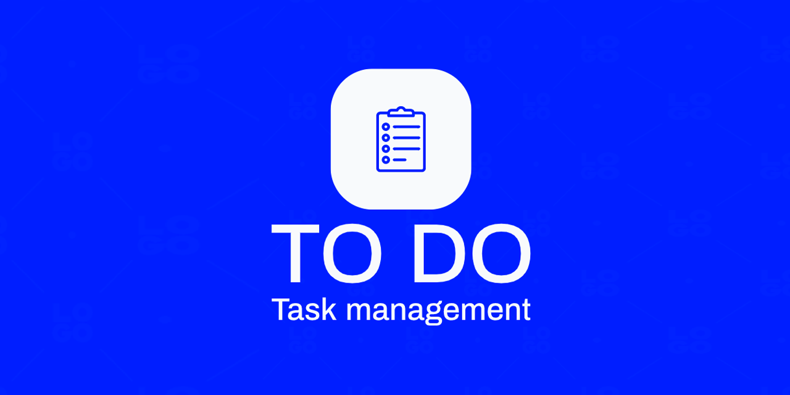

# To Do - Task management
This is a ToDo application project that allows users to manage their tasks.

The working app is available here: [charles-hl.github.io/ToDo-app](https://charles-hl.github.io/ToDo-app/)



### Functionnality
- Login 
- User & security management with token and session (in backend)
- Dark mode
- Language selection
- List of my tasks
- Change the state of my task
- See the detail of my task
- Creation of a new task

### Future Functionnality
- Modify and remove a task
- Show creation date of a task
- Save user preferences like language and theme in db
- Add password modification
- Add due date, reminder and notification
- Add task manual sorting
- Add websockets to allow sync between devices
- Manage tasks in a store for the angular front end
- Add possibilty to put tasks in categories (and add color)

### Installation
#### Server
To install the server with docker
- Clone the repository on your machine
- Run the script ```deploy-server.yml``` at the root of the project

#### Gui
The root of the gui is in ```gui/todo-app```

To use the app in production you need to specify the variables in ```gui/todo-app/src/environments/environment.prod.ts```

The gui can be deployed with angular cli, see [Angular Deployment](https://angular.io/guide/deployment)

You can also deploy it with the webserver nginx, see [Deploy an Angular app with nginx](https://medium.com/@technicadil_001/deploy-an-angular-app-with-nginx-a79cc1a44b49)

## Technical environment
### Server
The server is based on Java and the framework Spring Boot. It is covered by unit tests.

It also use PostgreSQL for the database.

It uses docker for its deployment.

### Gui
The gui is based on Angular 15.
